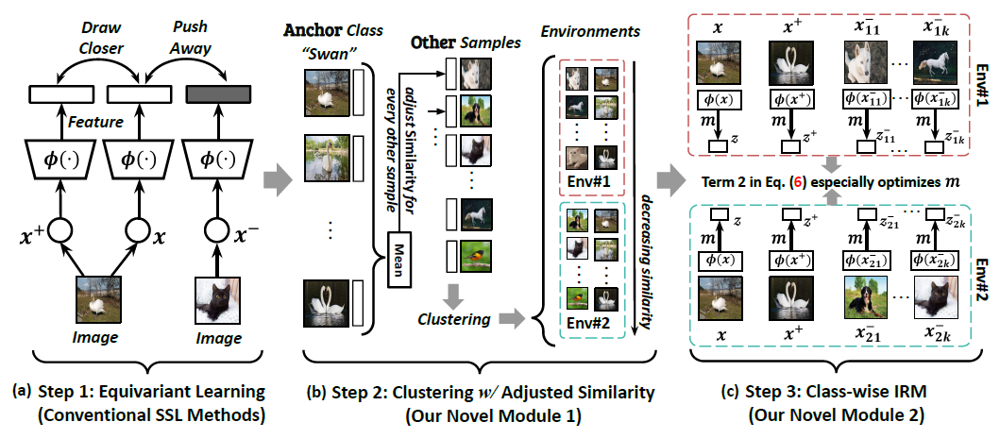

# [ECCV2022] EqInv

This repository contains the official PyTorch implementation of paper "Equivariance and Invariance Inductive Bias for Learning from Insufficient Data".

**Equivariance and Invariance Inductive Bias for Learning from Insufficient Data** <br />
[Tan Wang](https://wangt-cn.github.io/), [Qianru Sun](https://qianrusun.com/), Sugiri Pranata, Karlekar Jayashree, [Hanwang Zhang](https://www.ntu.edu.sg/home/hanwangzhang/) <br />
**European Conference on Computer Vision (ECCV), 2022** <br />
**[[Paper: Comming Soon]()] [[Poster: Comming Soon]()] [[Slides: Comming Soon]()]**<br />


<br />


## EqInv Algorithm

<div align="center">
  
</div>
<br />

**From this project, you can**:

- Try our algorithm for data efficient learning tasks, for example, [VIPriors Challenge](https://vipriors.github.io/).
- Use the dataset or generate your own data with our [script](tool/produce_vipriors_fewshot.py) for evaluation.
- Improve our equivariance and/or invariance idea and apply in your own project.


<br />


## BibTex

If you find our codes helpful, please cite our paper:

```
@inproceedings{wang2022equivariance,
  title={Equivariance and invariance inductive bias for learning from insufficient data},
  author={Wang, Tan and Sun, Qianru and Pranata, Sugiri and Jayashree, Karlekar and Zhang, Hanwang},
  booktitle={European Conference on Computer Vision},
  year={2022}
}
```

<br />


## Prerequisites

- Python 3.7
- PyTorch 1.9.0
- tqdm
- randaugment
- opencv-python


<br />

## Data Preparation
Please download dataset in this [link](hhttps://entuedu-my.sharepoint.com/:f:/g/personal/tan317_e_ntu_edu_sg/ElRJ-95QBEtOqtrtkFakdVQB6sej96uAiHIGpFOZr0VuMA?e=LoiUxo) and put it into the `data` folder.

**Ps:**

- We also provide the dataset generation script [here](tool/produce_vipriors_fewshot.py) and you can generate any efficient learning dataset that you want.
- Besides the `train` and `val` set, we also provide the `testgt` set for test accuracy evaluation. This can be achieved since VIPriors Challenge use the part of ImageNet Val set for testing.


<br />


## Training

#### 0. Main parameters (may need to be specified by user)
- `pretrain_path`: path of SSL pretrained models
- `stage1_model`: the model type of the SSL training stage. 
- `num_shot`: number of samples for each class in the dataset.
- `class_num`: number of classes in the dataset.
- `activate_type`: the activation type added on the mask.
- `inv_start`: when to add the invariance regularization.
- `inv_weight`: the weight of the invariance regularization.
- `opt_mask`: if optimize the mask.


<br />


#### 1. Run the baseline model#1 —— Training From Scratch

   ```
CUDA_VISIBLE_DEVICES=0,1,2,3 python baseline.py -b 256 --name vipriors10_rn50 -j 8 --lr 0.1 data/imagenet_10
   ```

You can also try the built-in augmentation algorithms, such as `Mixup`

   ```
CUDA_VISIBLE_DEVICES=0,1,2,3 python baseline.py -b 256 --name vipriors10_rn50_mixup -j 8 --lr 0.1 data/imagenet_10 --mixup
   ```


<br />


#### 2. Run the baseline model#2 —— Training From SSL

   ```
CUDA_VISIBLE_DEVICES=4,5,6,7 python baseline_eq_ipirm.py -b 256 --name vipriors10_rn50_lr0.1_ipirm -j 8 --lr 0.1 data/imagenet_10 --pretrain_path phase1_ssl_methods/run_imagenet10/ipirm_imagenet10/model_ipirm.pth
   ```

For the SSL pretraining process, please follow the chapter below.


<br />


#### 3. Run our EqInv model

**Step-1: SSL Pretraining (Equivariance Learning)**

Please follow the original codebase. We list the code we used below:

- MoCo-v2: https://github.com/facebookresearch/moco

- Simsiam: https://github.com/facebookresearch/simsiam

- IP-IRM: https://github.com/Wangt-CN/IP-IRM

- MAE: https://github.com/facebookresearch/mae

Please put the pretrained models in `phase1_ssl_methods`. You can also choose to directly use our SSL pretrained models (IP-IRM) [here](https://entuedu-my.sharepoint.com/:f:/g/personal/tan317_e_ntu_edu_sg/ErZGda3w1INBiQIuJ00RItMB-oaIkOLFB_a5uI_wxIShMQ?e=SSYNNb)


<br />

**Step-2/3: Downstream Fine-tuning (Invariance Learning)**

Running Commands

   ```
CUDA_VISIBLE_DEVICES=4,5,6,7 python vipriors_eqinv.py -b 128  --name vipriors10_ipirm_mask_sigmoid_rex100._start10 -j 24 data/imagenet_10 --pretrain_path phase1_ssl_methods/run_imagenet10/ipirm_imagenet10/model_ipirm.pth --inv rex --inv_weight 100. --opt_mask --activat_type sigmoid --inv_start 10 --mlp --stage1_model ipirm --num_shot 10
   ```

You can also adopt `Random Augmentation` to achieve better results:

   ```
CUDA_VISIBLE_DEVICES=4,5,6,7 python vipriors_eqinv.py -b 128  --name vipriors10_ipirm_mask_sigmoid_rex10._start10_randaug -j 24 data/imagenet_10 --pretrain_path phase1_ssl_methods/run_imagenet10/ipirm_imagenet10/model_ipirm.pth --inv rex --inv_weight 10. --opt_mask --activat_type sigmoid --inv_start 10 --mlp --stage1_model ipirm --num_shot 10 --random_aug
   ```

For other dataset, you can try:

```
CUDA_VISIBLE_DEVICES=0,1,2,3 python vipriors_eqinv.py -b 128  --name vipriors20_ipirm_mask_sigmoid_rex10._start10_randaug -j 24 data/imagenet_20 --pretrain_path phase1_ssl_methods/run_imagenet20/ipirm_imagenet20/model_ipirm.pth --inv rex --inv_weight 10. --opt_mask --activat_type sigmoid --inv_start 10 --mlp --stage1_model ipirm --num_shot 20 --random_aug
```

```
CUDA_VISIBLE_DEVICES=0,1,2,3 python vipriors_eqinv.py -b 128  --name vipriors50_ipirm_mask_sigmoid_rex10._start10_randaug -j 24 data/imagenet_50 --pretrain_path phase1_ssl_methods/run_imagenet50/ipirm_imagenet50/model_ipirm.pth --inv rex --inv_weight 10. --opt_mask --activat_type sigmoid --inv_start 10 --mlp --stage1_model ipirm --num_shot 50 --random_aug
```

<br />

If you have any questions, please feel free to email me (TAN317@ntu.edu.sg).